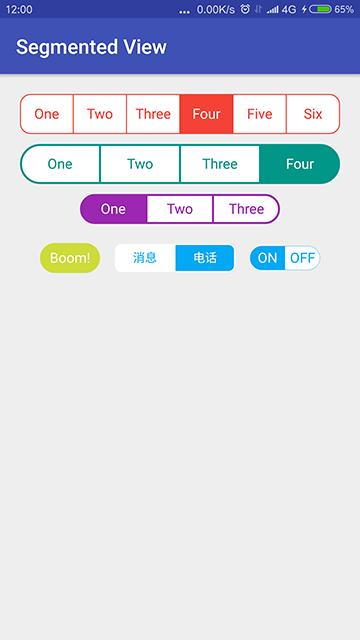

# segmentedview

[](https://jitpack.io/#czy1121/segmentedview) 

ios 风格的分段控件，类似 UISegmentedControl



## Gradle

``` groovy
repositories { 
    maven { url "https://jitpack.io" }
}
```  
    
``` groovy
dependencies {
    compile 'com.github.czy1121:segmentedview:1.0.0'
}
```
    
## Usage
    
**XML**

``` xml
<com.github.czy1121.view.SegmentedView
    android:id="@+id/sv1"
    android:layout_width="match_parent"
    android:layout_height="40dp"
    android:layout_marginBottom="10dp"
    app:svCornerRadius="10dp"
    app:svMainColor="#F44336"
    app:svStrokeWidth="1dp"
    app:svSubColor="#ffffff"
    app:svTexts="One|Two|Three|Four|Five|Six"/>
```

**绑定事件**

``` java

((SegmentedView)findViewById(resId)).setOnItemSelectedListener(new SegmentedView.OnItemSelectedListener() {
    @Override
    public void onSelected(int index, String text) {
        Toast.makeText(this,  index + " : " + text, Toast.LENGTH_SHORT).show();
    }
});
```

**属性**

``` xml
<declare-styleable name="SegmentedView">
    <!-- 字体大小 -->
    <attr name="android:textSize" />

    <!-- "|" 分隔的文本 -->
    <attr name="svTexts" format="string" />
    <!-- 主色, 用于边框, 分隔线, 选中项的背景, 未选中项的文本 -->
    <attr name="svMainColor" format="color"/>
    <!-- 补色, 用于未选中项的背景, 选中项的文本, 默认 #ffffff -->
    <attr name="svSubColor" format="color"/>
    <!-- 边框, 分隔线 的宽度 -->
    <attr name="svStrokeWidth" format="dimension"/>
    <!-- 圆角大小 -->
    <attr name="svCornerRadius" format="dimension" />
    <!-- item 左右的边距 -->
    <attr name="svHPadding" format="dimension"/>
    <!-- item 上下的边距 -->
    <attr name="svVPadding" format="dimension"/>
</declare-styleable>
```

## 参考

[SHSegmentControl](https://github.com/7heaven/SHSegmentControl)

## License

```
Copyright 2016 czy1121

Licensed under the Apache License, Version 2.0 (the "License");
you may not use this file except in compliance with the License.
You may obtain a copy of the License at

   http://www.apache.org/licenses/LICENSE-2.0

Unless required by applicable law or agreed to in writing, software
distributed under the License is distributed on an "AS IS" BASIS,
WITHOUT WARRANTIES OR CONDITIONS OF ANY KIND, either express or implied.
See the License for the specific language governing permissions and
limitations under the License.
```